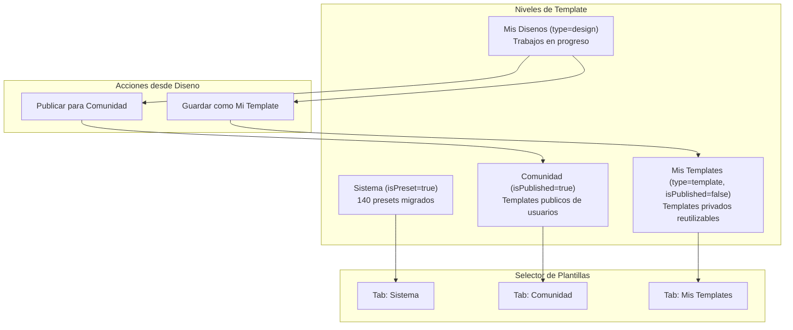
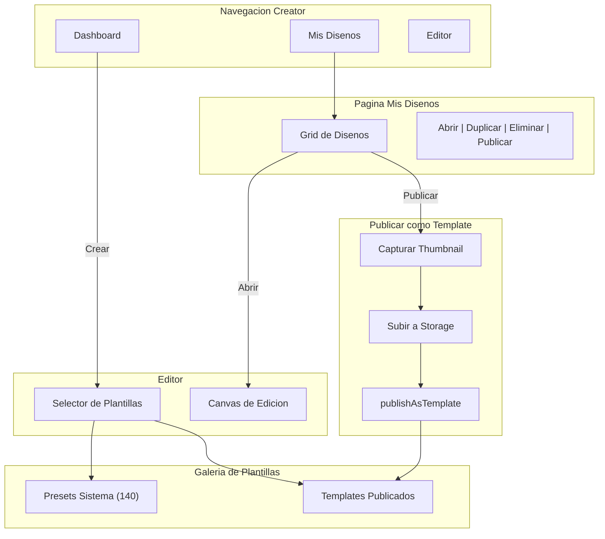

# Mis Disenos Feature

> **Para Claude Code:** Este plan esta listo para implementar. Sigue las tareas en orden.
>
> - Backend: `/Users/wilfredonoyola/workspace/futbolify/futbolify-backend-v2/`
> - Frontend: `/Users/wilfredonoyola/workspace/futbolify/futbolify-web-v2/`
> - Reusar patrones de Bunny en `BUNNY-INTEGRATION.md` y `DirectUploadModal.tsx`
> - Reusar thumbnail logic en `lib/creator/editor/imageStorage.ts`

## Arquitectura

El enfoque usa la entidad Template con 4 niveles:



**Tipos de Template:**

| isPreset | isPublished | type | Quien ve | Descripcion |
|----------|-------------|------|----------|-------------|
| true | - | template | Todos | Preset del sistema (140) |
| false | true | template | Todos | Template comunidad (publico) |
| false | false | template | Solo creador | Mi Template (privado reutilizable) |
| false | false | design | Solo creador | Mi Diseno (trabajo en progreso) |

**Dos acciones al guardar un diseno:**

1. **"Guardar como Mi Template"** → `type: 'template', isPublished: false`
   - Solo yo lo veo en "Mis Templates"
   - Puedo reutilizarlo en futuros disenos
   
2. **"Publicar para Comunidad"** → `type: 'template', isPublished: true`
   - Todos los usuarios lo ven en "Comunidad"
   - Genera thumbnail automatico

**Flujos:**

**A) Guardar como Mi Template (privado):**
1. Usuario tiene un diseno (type='design')
2. Click "Guardar como Mi Template"
3. Se captura thumbnail automaticamente
4. Se cambia `type: 'template'`, `isPublished: false`
5. Aparece en "Mis Templates" (solo yo)

**B) Publicar para Comunidad (publico):**
1. Usuario tiene un diseno o template privado
2. Click "Publicar para Comunidad"
3. Se captura thumbnail automaticamente
4. Se marca `isPublished: true`
5. Aparece en "Comunidad" (todos ven)

## Cambios en Backend

### 1. Actualizar Template Schema

**Archivo:** `futbolify-backend-v2/src/creator/schemas/template.schema.ts`

Agregar campos:

```typescript
@Field(() => String, { defaultValue: 'template' })
@Prop({ type: String, enum: ['template', 'design'], default: 'template', index: true })
type: 'template' | 'design';

@Field(() => ID, { nullable: true })
@Prop({ type: MongooseSchema.Types.ObjectId, ref: 'Post' })
postId?: string; // Para disenos vinculados a un post

@Field(() => String, { nullable: true })
@Prop({ type: String, index: true })
presetCategory?: string; // Para templates preset: 'transfer', 'matchday', etc.
```

### 2. Actualizar Template Service

**Archivo:** `futbolify-backend-v2/src/creator/template.service.ts`

Agregar metodos:

```typescript
// Obtener MIS DISENOS (trabajos en progreso)
async findUserDesigns(userId: string): Promise<Template[]> {
  return this.templateModel
    .find({ userId, type: 'design' })
    .sort({ updatedAt: -1 })
    .exec();
}

// Obtener MIS TEMPLATES (privados reutilizables)
async findMyTemplates(userId: string): Promise<Template[]> {
  return this.templateModel
    .find({ userId, type: 'template', isPublished: false, isPreset: false })
    .sort({ updatedAt: -1 })
    .exec();
}

// Obtener PRESETS del sistema por categoria
async findPresetsByCategory(category?: string): Promise<Template[]> {
  const query: any = { isPreset: true };
  if (category) query.presetCategory = category;
  return this.templateModel.find(query).sort({ name: 1 }).exec();
}

// Obtener TEMPLATES COMUNIDAD (publicados por usuarios)
async findCommunityTemplates(category?: string): Promise<Template[]> {
  const query: any = { isPublished: true, isPreset: false };
  if (category) query.category = category;
  return this.templateModel.find(query).sort({ createdAt: -1 }).exec();
}

// Guardar como MI TEMPLATE (privado)
async saveAsMyTemplate(
  designId: string, 
  userId: string, 
  thumbnailUrl: string
): Promise<Template> {
  const design = await this.templateModel.findOne({ _id: designId, userId });
  if (!design) throw new Error('Design not found');
  
  design.type = 'template';
  design.isPublished = false; // Privado
  design.thumbnail = thumbnailUrl;
  return design.save();
}

// Publicar para COMUNIDAD (publico)
async publishToCommunity(
  templateId: string, 
  userId: string, 
  thumbnailUrl: string
): Promise<Template> {
  const template = await this.templateModel.findOne({ _id: templateId, userId });
  if (!template) throw new Error('Template not found');
  
  template.type = 'template';
  template.isPublished = true; // Publico
  template.thumbnail = thumbnailUrl;
  return template.save();
}
```

### 3. Actualizar Template Resolver

**Archivo:** `futbolify-backend-v2/src/creator/template.resolver.ts`

Agregar queries y mutations:

```typescript
// MIS DISENOS (trabajos en progreso)
@Query(() => [Template])
async myDesigns(@CurrentUser() user: any): Promise<Template[]> {
  return this.templateService.findUserDesigns(user.userId);
}

// MIS TEMPLATES (privados reutilizables)
@Query(() => [Template])
async myTemplates(@CurrentUser() user: any): Promise<Template[]> {
  return this.templateService.findMyTemplates(user.userId);
}

// PRESETS del sistema
@Query(() => [Template])
async presetTemplates(
  @Args('category', { nullable: true }) category?: string
): Promise<Template[]> {
  return this.templateService.findPresetsByCategory(category);
}

// TEMPLATES COMUNIDAD
@Query(() => [Template])
async communityTemplates(
  @Args('category', { nullable: true }) category?: string
): Promise<Template[]> {
  return this.templateService.findCommunityTemplates(category);
}

// Guardar como MI TEMPLATE
@Mutation(() => Template)
async saveAsMyTemplate(
  @CurrentUser() user: any,
  @Args('designId') designId: string,
  @Args('thumbnailUrl') thumbnailUrl: string
): Promise<Template> {
  return this.templateService.saveAsMyTemplate(designId, user.userId, thumbnailUrl);
}

// Publicar para COMUNIDAD
@Mutation(() => Template)
async publishToCommunity(
  @CurrentUser() user: any,
  @Args('templateId') templateId: string,
  @Args('thumbnailUrl') thumbnailUrl: string
): Promise<Template> {
  return this.templateService.publishToCommunity(templateId, user.userId, thumbnailUrl);
}

// Templates publicados por usuarios
@Query(() => [Template])
async publishedTemplates(
  @Args('category', { nullable: true }) category?: string
): Promise<Template[]> {
  return this.templateService.findPublishedTemplates(category);
}

// Publicar diseno como template
@Mutation(() => Template)
async publishAsTemplate(
  @CurrentUser() user: any,
  @Args('designId') designId: string,
  @Args('thumbnailUrl') thumbnailUrl: string
): Promise<Template> {
  return this.templateService.publishAsTemplate(designId, user.userId, thumbnailUrl);
}
```

### 4. Script de Seed para Migrar Presets

**Archivo:** `futbolify-backend-v2/src/creator/seeds/preset-templates.seed.ts`

Crear script que:

1. Lee los 140 presets desde archivos JSON exportados del frontend
2. Inserta cada preset como Template con `isPreset: true` y `presetCategory`
3. Genera thumbnails si es necesario

**Datos a migrar (140 templates en 20 categorias):**


| Categoria  | Cantidad | Ejemplos                                           |
| ---------- | -------- | -------------------------------------------------- |
| transfer   | 15       | fichajePro, fichajeCentered, fichajeMinimal        |
| matchday   | 15       | matchDayPro, matchDaySidebar, matchDayMinimal      |
| result     | 15       | resultadoPro, resultadoMinimal, resultadoEditorial |
| quote      | 14       | citaPro, citaDoblePro, citaMinimal                 |
| collage    | 13       | collagePro, collage4Pro, collageMosaic             |
| lineup     | 6        | alineacionHeroPro, alineacionListaPro              |
| mvp        | 6        | mvpPro, mvpSidebar, goleadorPro                    |
| social     | 10       | instagramPost, twitterPost, whatsappStatus         |
| meme       | 10       | memeClasico, memeDrake, memeReaccion               |
| live       | 4        | liveGoalPro, liveHalftimePro                       |
| breaking   | 3        | ultimaHoraPro, breakingSidebar                     |
| rumor      | 3        | bombaPro, rumorEditorial                           |
| ranking    | 3        | top5Pro, top3Pro                                   |
| comparison | 3        | vsPro, vsDiagonal                                  |
| throwback  | 3        | throwbackPro, throwbackFilm                        |
| trivia     | 3        | datoCuriosoPro, datoVisual                         |
| engagement | 3        | encuestaPro, encuestaSlider                        |
| stats      | 3        | statsPro, statsCards                               |
| farewell   | 3        | despedidaPro, despedidaEditorial                   |


**Proceso de migracion:**

```typescript
// 1. Exportar presets del frontend a JSON
// lib/creator/editor/presets/export-presets.ts
export function exportPresetsToJSON() {
  return ALL_PRESETS.map(preset => ({
    presetId: preset.id,
    name: preset.name,
    description: preset.description,
    category: preset.category,
    presetCategory: preset.category,
    isPreset: true,
    type: 'template',
    width: preset.template.width,
    height: preset.template.height,
    backgroundColor: preset.template.backgroundColor,
    templateData: preset.template,
  }));
}

// 2. Seed script en backend
async function seedPresets() {
  const presets = require('./preset-data.json');
  for (const preset of presets) {
    await this.templateModel.findOneAndUpdate(
      { presetId: preset.presetId },
      preset,
      { upsert: true }
    );
  }
}
```

## Cambios en Frontend

### 5. Crear Pagina Mis Disenos

**Archivo:** `app/[locale]/(creator)/creator/designs/page.tsx`

Pagina que muestra grid de disenos del usuario con:

- Filtros por origen (todos, en blanco, desde plantilla, desde post)
- Busqueda por nombre
- Acciones: abrir, duplicar, eliminar
- Estado vacio con CTA para crear

### 6. Componente DesignsGrid

**Archivo:** `components/Creator/designs/DesignsGrid.tsx`

Grid de tarjetas mostrando:

- Thumbnail del diseno
- Nombre
- Fecha de modificacion
- Badge de origen (blanco, plantilla, post)
- Menu de acciones

### 7. Agregar Link en Navegacion

**Archivo:** `app/[locale]/(creator)/layout.tsx`

Agregar item en `navItems` despues de Dashboard:

```typescript
{
  label: "Mis Disenos",
  href: "/creator/designs",
  icon: Images, // o FolderOpen
  isActive: path.includes("/designs"),
  isPrimary: true,
}
```

### 8. Actualizar Selector de Plantillas

**Archivo:** `components/Creator/editor/TemplateSelector.tsx` (o donde se seleccionan plantillas)

Cambiar de importar presets locales a cargar desde backend:

```typescript
// ANTES (hardcoded)
import { ALL_PRESETS } from '@/lib/creator/editor/presets';
const presets = ALL_PRESETS;

// DESPUES (desde backend)
const { data } = usePresetTemplatesQuery({ variables: { category } });
const presets = data?.presetTemplates ?? [];
```

Beneficios:

- Plantillas actualizables sin deploy
- Mismas plantillas en web y Flutter
- Menos peso en el bundle JS inicial

### 9. Actualizar Editor para Guardar Disenos

**Archivo:** `components/Creator/editor/TemplateEditor.tsx`

Modificar logica de guardado:

- Si viene de un Post: guardar `templateData` en el Post (comportamiento actual)
- Si es diseno libre o desde plantilla: crear/actualizar Template con `type='design'`
- Mostrar dialogo "Guardar como" para nuevos disenos

### 10. Actualizar Hook de AutoSave

**Archivo:** `hooks/useAutoSaveTemplate.ts`

Extender para soportar guardado en Template (no solo Post):

```typescript
interface UseAutoSaveTemplateOptions {
  postId?: string;        // Guardar en Post.templateData
  designId?: string;      // Guardar en Template (type='design')
  enabled?: boolean;
}
```

## GraphQL Schema Updates

### 11. Crear template.graphql

**Archivo:** `components/Creator/graphql/template.graphql`

```graphql
fragment TemplateFields on Template {
  id
  name
  description
  category
  presetCategory
  type
  thumbnail
  width
  height
  backgroundColor
  templateData
  postId
  isPreset
  isPublished
  userId
  createdAt
  updatedAt
}

# Mis disenos privados
query MyDesigns {
  myDesigns {
    ...TemplateFields
  }
}

# Presets del sistema (140)
query PresetTemplates($category: String) {
  presetTemplates(category: $category) {
    ...TemplateFields
  }
}

# Templates publicados por usuarios
query PublishedTemplates($category: String) {
  publishedTemplates(category: $category) {
    ...TemplateFields
  }
}

mutation CreateDesign($input: CreateTemplateInput!) {
  createTemplate(input: $input) {
    ...TemplateFields
  }
}

mutation UpdateDesign($input: UpdateTemplateInput!) {
  updateTemplate(input: $input) {
    ...TemplateFields
  }
}

mutation DeleteDesign($id: ID!) {
  deleteTemplate(id: $id)
}

# Publicar diseno como template publico
mutation PublishAsTemplate($designId: ID!, $thumbnailUrl: String!) {
  publishAsTemplate(designId: $designId, thumbnailUrl: $thumbnailUrl) {
    ...TemplateFields
  }
}
```

## Captura y Upload de Thumbnail (Alta Calidad)

### 12. Captura de canvas en alta calidad

**Archivo:** `components/Creator/editor/utils/captureCanvas.ts`

Reusar el patron existente en `lib/creator/editor/imageStorage.ts` pero con mejor calidad:

```typescript
import html2canvas from 'html2canvas';

export interface CaptureOptions {
  scale?: number;      // 2 para alta calidad (default)
  quality?: number;    // 0.92 para JPEG alta calidad
  maxWidth?: number;   // 800px para thumbnail
}

export async function captureCanvasAsBlob(
  canvasRef: HTMLDivElement,
  options: CaptureOptions = {}
): Promise<Blob> {
  const { scale = 2, quality = 0.92, maxWidth = 800 } = options;
  
  // Captura en alta resolucion
  const canvas = await html2canvas(canvasRef, {
    scale,
    useCORS: true,
    allowTaint: true,
    backgroundColor: null, // Preservar transparencia si hay
  });
  
  // Redimensionar si es necesario (mantener aspect ratio)
  let finalCanvas = canvas;
  if (canvas.width > maxWidth * scale) {
    const ratio = (maxWidth * scale) / canvas.width;
    const resizedCanvas = document.createElement('canvas');
    resizedCanvas.width = canvas.width * ratio;
    resizedCanvas.height = canvas.height * ratio;
    const ctx = resizedCanvas.getContext('2d');
    ctx?.drawImage(canvas, 0, 0, resizedCanvas.width, resizedCanvas.height);
    finalCanvas = resizedCanvas;
  }
  
  return new Promise((resolve, reject) => {
    finalCanvas.toBlob(
      (blob) => blob ? resolve(blob) : reject(new Error('Failed to create blob')),
      'image/jpeg',
      quality
    );
  });
}
```

### 13. Upload a Bunny Storage (Reusar patron existente)

**Reusar el flujo de direct upload existente** en `components/Futbolify/Media/DirectUploadModal.tsx`:

```typescript
// components/Creator/designs/utils/uploadThumbnail.ts
const API_URL = process.env.NEXT_PUBLIC_API_URL;

export async function uploadTemplateThumbnail(
  blob: Blob,
  templateId: string,
  token: string
): Promise<string> {
  const filename = `template_${templateId}_${Date.now()}.jpg`;
  
  // Step 1: Init - Obtener URL de upload
  // NOTA: Puede necesitar nuevo endpoint o reusar /direct-upload/photo/init
  const initResponse = await fetch(`${API_URL}/direct-upload/template-thumbnail/init`, {
    method: 'POST',
    headers: {
      'Content-Type': 'application/json',
      Authorization: `Bearer ${token}`,
    },
    body: JSON.stringify({ templateId, filename }),
  });
  
  const { uploadUrl, cdnUrl, headers } = await initResponse.json();
  
  // Step 2: Upload directo a Bunny
  await fetch(uploadUrl, {
    method: 'PUT',
    headers: {
      ...headers,
      'Content-Type': 'image/jpeg',
    },
    body: blob,
  });
  
  // Step 3: Complete (opcional - registrar en backend)
  await fetch(`${API_URL}/direct-upload/template-thumbnail/complete`, {
    method: 'POST',
    headers: {
      'Content-Type': 'application/json',
      Authorization: `Bearer ${token}`,
    },
    body: JSON.stringify({ templateId, cdnUrl }),
  });
  
  return cdnUrl;
}
```

**Path structure para thumbnails:**

```
templates/{userId}/thumbnail_{templateId}_{timestamp}.jpg
```

**CDN URL resultado:**

```
https://futbolify.b-cdn.net/templates/{userId}/thumbnail_{templateId}_{timestamp}.jpg
```

### 14. Flujo completo de publicacion

**Archivo:** `components/Creator/designs/PublishTemplateDialog.tsx`

```typescript
import { captureCanvasAsBlob } from './utils/captureCanvas';
import { uploadTemplateThumbnail } from './utils/uploadThumbnail';
import { usePublishAsTemplateMutation } from '@/generated/graphql';

export function PublishTemplateDialog({ 
  designId, 
  canvasRef, 
  onSuccess 
}: Props) {
  const [publishAsTemplate] = usePublishAsTemplateMutation();
  const [isPublishing, setIsPublishing] = useState(false);
  
  async function handlePublish() {
    setIsPublishing(true);
    try {
      // 1. Capturar canvas en alta calidad
      const blob = await captureCanvasAsBlob(canvasRef.current, {
        scale: 2,        // Alta resolucion
        quality: 0.92,   // Alta calidad JPEG
        maxWidth: 800,   // Thumbnail razonable
      });
      
      // 2. Subir a Bunny Storage
      const token = await getAccessToken(); // NextAuth
      const thumbnailUrl = await uploadTemplateThumbnail(blob, designId, token);
      
      // 3. Marcar como publicado
      await publishAsTemplate({
        variables: { designId, thumbnailUrl },
      });
      
      toast.success('Template publicado exitosamente');
      onSuccess?.();
    } catch (error) {
      toast.error('Error al publicar template');
    } finally {
      setIsPublishing(false);
    }
  }
  
  return (
    <Dialog>
      <DialogContent>
        <DialogHeader>
          <DialogTitle>Publicar como Template</DialogTitle>
          <DialogDescription>
            Tu diseno estara disponible para todos los usuarios
          </DialogDescription>
        </DialogHeader>
        <DialogFooter>
          <Button onClick={handlePublish} disabled={isPublishing}>
            {isPublishing ? 'Publicando...' : 'Publicar'}
          </Button>
        </DialogFooter>
      </DialogContent>
    </Dialog>
  );
}
```

## Flujo de Usuario




## Beneficios

1. **Multiplataforma** - Web y Flutter usan mismas plantillas desde API
2. **Sin Deploy** - Agregar/editar plantillas sin redesplegar
3. **Bundle Ligero** - 140 templates no en JS inicial
4. **Comunidad** - Usuarios publican templates para otros
5. **Thumbnails** - Preview automatico de cada template en alta calidad
6. **Escalable** - Preparado para filtros por equipo (futuro)

---

## Referencia de Implementacion (Para Claude Code)

### Archivos Clave a Modificar/Crear

**Backend (futbolify-backend-v2):**

```
src/creator/schemas/template.schema.ts    # Agregar type, postId, presetCategory
src/creator/template.service.ts           # Nuevos metodos
src/creator/template.resolver.ts          # Nuevas queries/mutations
src/creator/seeds/preset-templates.seed.ts # NUEVO - seed de presets
src/direct-upload/                         # Endpoint para thumbnail upload
```

**Frontend (futbolify-web-v2):**

```
app/[locale]/(creator)/layout.tsx                    # Agregar nav link
app/[locale]/(creator)/creator/designs/page.tsx      # NUEVO - pagina mis disenos
components/Creator/designs/DesignsGrid.tsx           # NUEVO - grid de disenos
components/Creator/designs/PublishTemplateDialog.tsx # NUEVO - dialog publicar
components/Creator/designs/utils/captureCanvas.ts    # NUEVO - captura canvas
components/Creator/designs/utils/uploadThumbnail.ts  # NUEVO - upload bunny
components/Creator/graphql/template.graphql          # NUEVO - schema graphql
hooks/useAutoSaveTemplate.ts                         # Extender con designId
```

### Patrones a Reusar


| Patron                       | Archivo de Referencia                                  |
| ---------------------------- | ------------------------------------------------------ |
| Bunny Upload (init/complete) | `components/Futbolify/Media/DirectUploadModal.tsx`     |
| Thumbnail generation         | `lib/creator/editor/imageStorage.ts` (createThumbnail) |
| Template schema              | `lib/creator/editor/types.ts`                          |
| Presets existentes           | `lib/creator/editor/presets/index.ts`                  |
| Grid de cards                | `components/Creator/home/ContentDashboard.tsx`         |
| Navigation items             | `app/[locale]/(creator)/layout.tsx` (navItems)         |


### Variables de Entorno Necesarias

```bash
# Ya configuradas para Bunny
BUNNY_STORAGE_ZONE_NAME=futbolifystoragezone
BUNNY_STORAGE_API_KEY=...
BUNNY_STORAGE_REGION=storage
BUNNY_STORAGE_CDN_HOSTNAME=futbolify.b-cdn.net
```

### Orden de Implementacion Sugerido

1. **Backend primero** (tasks 1-5):
  - Schema > Service > Resolver > Thumbnail endpoint > Seed script
2. **Frontend GraphQL** (task 6):
  - Crear template.graphql y correr `yarn codegen`
3. **Frontend UI** (tasks 7-12):
  - Navigation > Designs page > Editor save > AutoSave > Publish dialog

### Comandos Utiles

```bash
# Frontend
cd futbolify-web-v2
yarn codegen          # Regenerar tipos GraphQL
yarn dev              # Dev server
yarn lint             # Verificar linting

# Backend
cd futbolify-backend-v2
npm run start:dev     # Dev server
npm run seed:presets  # Ejecutar seed (despues de crear)
```

